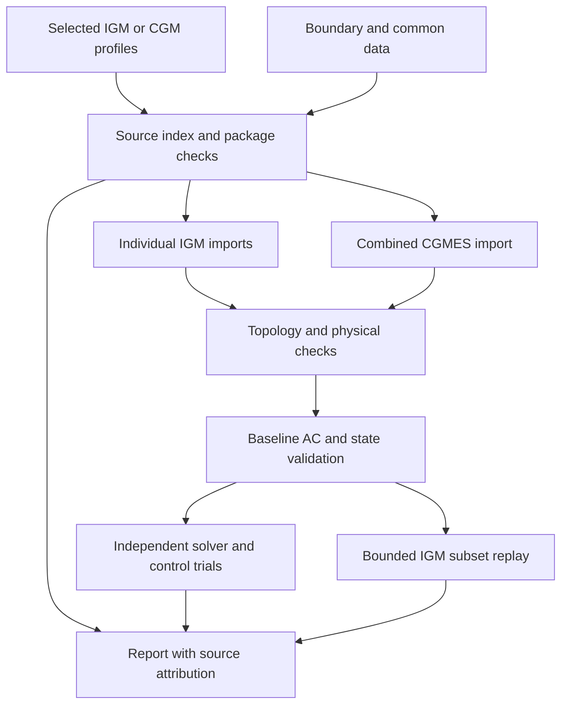
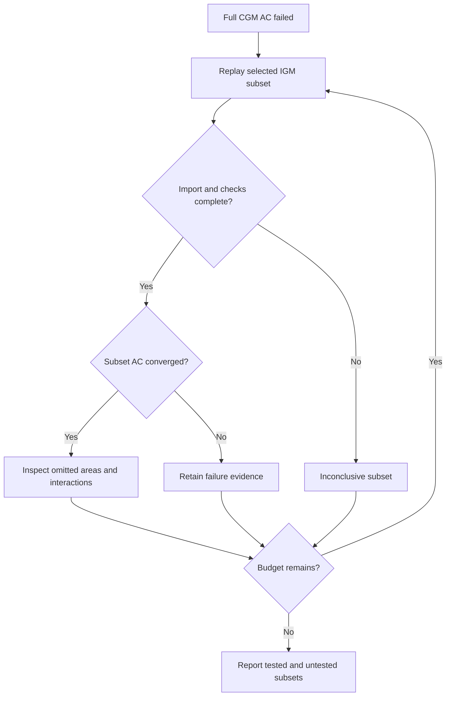

# Dr.CGM — diagnose the IGM → CGM process with PowSyBl

Dr.CGM is an offline Python tool for RCC engineers investigating CGMES data quality, import failures and load-flow non-convergence. It connects source records to PowSyBl evidence, compares individual IGMs with their combined replay, and runs controlled experiments to narrow the investigation.

**Version 0.2.0 expands the original proof of concept.** It includes 14 baseline/sensitivity cases, optional equipment-control experiments, area net-position evidence, bounded IGM subset replay, snapshot/configuration comparison and a ReliCapGrid manifest builder. See the [checklist coverage audit](docs/coverage.md) for implemented, partial and deferred items.

This is an engineering diagnostic tool. It does not reproduce an RCC's complete production alignment pipeline or certify CGMES/NCP conformance. A converged experiment is evidence of sensitivity, not proof of a defective component or approval to change operational settings. Source files are never repaired or overwritten.

## How the diagnosis is organized



A combined replay imports all selected CGMES profiles together; it is not a blind merge of independently converted networks. `igms` mode replays each delivery and then their union. `cgm` mode imports one already assembled package, such as RCC TP/SV plus updated SSH and original EQ, without pretending to recover the original IGMs.

## Windows setup from scratch

Use **Windows x64 and CPython 3.12 x64** for the documented setup. Native PyPowSyBl wheels are required. This project pins PyPowSyBl 1.16.1. You do not need to install Java, Maven or a separate PowSyBl distribution when using its published wheel.

### 1. Install Python and Git

Open PowerShell. If Windows Package Manager is available:

```powershell
winget install --exact --id Python.Python.3.12
winget install --exact --id Git.Git
```

Alternatively install Python 3.12 x64 from [python.org](https://www.python.org/downloads/windows/) and Git for Windows from [git-scm.com](https://git-scm.com/downloads/win). Include the Python launcher in the Python installation. Use your organization's approved packages where required.

Close and reopen PowerShell so PATH changes are visible. Verify:

```powershell
py -3.12 --version
git --version
py -3.12 -c "import struct; print(struct.calcsize('P') * 8)"
```

The last command must print `64`. A Windows ARM machine needs a supported x64 Python environment; a native ARM wheel is not assumed.

### 2. Clone and install dependencies

```powershell
New-Item -ItemType Directory -Force "$env:USERPROFILE\source" | Out-Null
Set-Location "$env:USERPROFILE\source"
git clone https://github.com/zanynik/Dr.CGM.git
Set-Location Dr.CGM
py -3.12 -m venv .venv
.\.venv\Scripts\python.exe -m pip install --upgrade pip
.\.venv\Scripts\python.exe -m pip install --only-binary=:all: -r requirements.txt
.\.venv\Scripts\python.exe -c "import pypowsybl as p; print(p.__version__); print(p.loadflow.get_provider_names())"
```

Expect version `1.16.1` and `OpenLoadFlow` among the providers. All commands use the virtual environment's executable directly, so PowerShell activation and an execution-policy change are unnecessary. Run commands from the repository root.

### 3. Run a healthy synthetic example

```powershell
.\.venv\Scripts\python.exe make_demo.py --out demo-input
.\.venv\Scripts\python.exe diagnose.py --manifest demo-input\healthy.json --out runs\healthy
$LASTEXITCODE
Start-Process runs\healthy\report.html
```

Expect exit code `0`, completed replay and converged baseline AC. The generator creates an IEEE 14-bus CGMES 3.0 export locally using PowSyBl. It also creates deliberately broken and stressed cases:

```powershell
# Exit 1 expected: missing equipment reference, zero base voltage and mixed timestamps.
.\.venv\Scripts\python.exe diagnose.py --manifest demo-input\broken-source.json --out runs\broken --preflight-only

# Exit 1 expected: actual AC non-convergence after a tenfold load increase.
.\.venv\Scripts\python.exe diagnose.py --manifest demo-input\stressed.json --out runs\stressed
Start-Process runs\stressed\report.html
```

`make_demo.py` and `diagnose.py` require new output directories. Choose a new run name when repeating a case; existing evidence is preserved.

### 4. Run the regression suite

```powershell
.\.venv\Scripts\python.exe -m pip install -r requirements-dev.txt
.\.venv\Scripts\python.exe -m pytest -q
```

Tests exercise the actual importer and OpenLoadFlow, not only mocks. The repository includes Windows and Ubuntu CI jobs; see [TESTING.md](TESTING.md) and the repository's Actions page for validation status.

### 5. Set up a real case

Keep operational data in an approved local folder. Example layout: `C:\RCC\case-001\case.json`, `C:\RCC\case-001\inputs\TSO_A.zip`, `TSO_B.zip`, and `BOUNDARY.zip`. Copy the JSON below into `case.json`, replace paths and use exactly one selected scenario and revision per model:

```json
{
  "igms": [
    {"name": "TSO_A", "files": ["inputs/TSO_A.zip"]},
    {"name": "TSO_B", "files": ["inputs/TSO_B.zip"]}
  ],
  "boundaries": ["inputs/BOUNDARY.zip"],
  "common_data": [],
  "required_profiles": ["EQ", "SSH", "TP"],
  "engine": {"timeout_seconds": 300, "experiments": true}
}
```

```powershell
.\.venv\Scripts\python.exe diagnose.py --manifest C:\RCC\case-001\case.json --out C:\RCC\results\case-001
Start-Process C:\RCC\results\case-001\report.html
```

JSON paths accept forward slashes on Windows. Backslashes in JSON must be doubled (`C:\\RCC\\inputs`). Relative paths are resolved from the **manifest directory**, not the shell's current directory. Input entries can be XML files, ZIPs or directories scanned recursively for XML/ZIP. Avoid pointing to a parent folder containing several scenarios.

### Windows troubleshooting and offline installation

| Symptom | Action |
|---|---|
| `py` is not recognized | Reopen PowerShell, install the Python launcher, or use the full path to Python 3.12 x64. |
| No matching PyPowSyBl distribution | Check Python version and 64-bit architecture; upgrade pip; verify your package mirror carries the pinned wheel. Do not substitute an untested source build silently. |
| Native DLL import fails | Confirm x64 Python and wheel architecture. Check the official PyPowSyBl installation guidance and install the [Microsoft Visual C++ x64 runtime](https://learn.microsoft.com/en-us/cpp/windows/latest-supported-vc-redist) if the loader reports it missing. |
| Proxy/certificate errors | Use the approved corporate pip mirror and certificate configuration. |
| Long path / access errors | Use a short writable folder, such as `C:\RCC`, and a writable temporary directory with enough free space. |
| Worker timeout | Read checkpointed `result.json` and logs; raise the per-scope budget only after identifying the expensive stage. |
| Output already exists | Select a new `--out` directory. |

For an offline machine, download wheels on a connected machine with the **same OS, architecture and Python version**:

```powershell
py -3.12 -m pip download --only-binary=:all: -r requirements.txt --dest wheels
# Copy the source and approved wheels to the offline machine, create its venv, then:
.\.venv\Scripts\python.exe -m pip install --no-index --find-links wheels -r requirements.txt
```

The diagnosis itself makes no HTTP or LLM calls. Installation and cloning need network access; reports open locally. Reports include model identifiers, values and file paths and should remain with their input data.

## Linux setup

```bash
python3.12 -m venv .venv
.venv/bin/python -m pip install --only-binary=:all: -r requirements.txt
.venv/bin/python make_demo.py --out demo-input
.venv/bin/python diagnose.py --manifest demo-input/healthy.json --out runs/healthy
```

## Input modes and profile selection

For a completed CGM package use this instead of `igms`:

```json
{
  "cgm": {"files": ["inputs/CGM.zip"]},
  "boundaries": [],
  "common_data": [],
  "engine": {"timeout_seconds": 600}
}
```

`igms` and `cgm` are mutually exclusive. Use `common_data` for shared common-data files and `boundaries` for explicit boundary dependencies. Exact duplicate file content is deduplicated for engine import. Different contents sharing a model ID are flagged. Required replay profiles default to EQ/SSH/TP; SV is optional. Adjust `required_profiles` for an intentional earlier stage.

Both CGMES 3.0/CIM100 and older CIM16 namespaces are recognized by the source index; mixing them in one package is flagged. There is no blanket TPBD requirement for CGMES 3.0. FullModel headers and selected DCAT Dataset boundary metadata (`keyword`, `conformsTo`, `requires`, `startDate`) are indexed. Recognition in the source index does not guarantee native-import compatibility.

Supply full snapshots. DifferenceModels must be applied to their baselines beforehand. Nested ZIPs and nested/blank-node RDF are unsupported; DTDs/entities are rejected. Extra non-XML ZIP members are ignored. This is a flat CGMES CIM/XML index, not a general RDF/XML or schema validator.

## Diagnostic coverage

| Layer | Main checks and evidence |
|---|---|
| Package | XML, SHA-256 inventory, profiles, missing/cyclic dependencies, model-ID reuse, mixed CIM versions, scenario times, ownership metadata |
| Source | Selected missing/wrong-type references; conflicting scalar values; repeated descriptions within a file; reused mRIDs; overlapping IGM equipment; terminal/transformer-end links; invalid numbers, ratings, taps and missing switch states |
| Import | Each IGM and combined package; text/JSON native report; upstream warnings/errors; exact source matches through RDF IDs, mRIDs and aliases |
| Topology | Connected/synchronous components, single-bus islands, disconnected injections, regulating-source candidates, switches/terminals and boundary pairing |
| Electrical data | Generator P/Q limits, remote voltage targets, competing targets, winding rated-voltage/base checks, line/transformer impedance checks, tap ranges, HVDC P and VSC Q-limit checks |
| Balance | Partial component/country schedules, generator active-limit margins, native area boundary interchange versus targets, user-supplied before/after alignment measurements |
| AC/DC | All connected components by default, reference/slack IDs, iterations, status, mismatch and native outer-loop/balancing events; final reported NR residual locations and adjacent equipment |
| State | Imported SV consistency when present; validation and voltage/Q-margin checks after a successful baseline |
| Experiments | 14 planned baseline/sensitivity cases plus up to ten selected-control trials on pristine variants |
| Localization | Bounded leave-one-IGM-out or explicit subsets when the full CGM baseline fails |
| Comparison | Added/removed CIM statements and changed diagnostic configuration against a previous report |

Repeated IDs across EQ/SSH/TP are expected. Negative reactance, negative load, external unpaired boundaries and multiple synchronous areas are not categorically invalid. A selected boundary pairing key is only an error if explicitly listed in `expected_internal_boundary_keys` and still unpaired in the CGM.

Thresholds are diagnostic heuristics, not operating rules. Source checks cover selected attributes and relationships. See [coverage.md](docs/coverage.md) for important gaps.

## Experiments and their interpretation

| Trial | Change from the configured baseline |
|---|---|
| `baseline_ac` | Configured AC replay |
| `dc_initialization` | AC using DC-derived voltage initialization |
| `previous_values` | AC using imported voltages; skipped if the imported state is incomplete/nonfinite |
| `full_voltage_initialization` | OpenLoadFlow `voltageInitModeOverride=FULL_VOLTAGE` |
| `reactive_limits_off` | Disable generator reactive-limit enforcement |
| `transformer_voltage_control_off` | Disable transformer voltage control |
| `shunt_voltage_control_off` | Disable shunt voltage control |
| `phase_control_off` | Disable phase-shifter regulation |
| `single_slack` | Disable distributed slack |
| `generation_p_balance` | Distribute active mismatch in proportion to generation P |
| `load_balance` | Distribute active mismatch in proportion to load |
| `multiple_slack_buses` | Set `maxSlackBusCount=3` |
| `fix_voltage_targets` | Enable the provider's voltage-target handling option |
| `dc_loadflow` | Separate, simplified DC calculation |

Each trial clones the imported variant and discards it afterward. Provider parameter overrides are merged with baseline settings. Trials identical to baseline are skipped. By default, sensitivity trials run only after baseline failure; set `experiments_on_success: true` to run them after success too. Skips, failures and timeouts are visible.

These are one-setting sensitivities, not a factorial search of interacting controls. Existing provider overrides can influence an initialization trial: inspect `effective_parameters`. `fix_voltage_targets` uses the provider's defined behavior; it is not a general source-data repair. DC success does not prove AC feasibility or valid topology. A successful Q-limits-off trial does not make that setting operationally acceptable.

Selected control examples (IDs must be exact imported IIDM IDs):

```json
"control_experiments": [
  {"kind": "generator", "element_id": "GENERATOR_UUID"},
  {"kind": "ratio_tap", "element_id": "TRANSFORMER_UUID"}
]
```

Place this within `engine`. Supported kinds: `generator`, `ratio_tap`, `phase_tap`, `shunt`. Ambiguous multi-leg tap identifiers fail visibly. Missing or already-disabled controls are recorded; the list is limited to ten. These variants only affect the diagnostic process.

## Area balance and alignment evidence

Native area interchange is reported when imported `Area` definitions have boundary records and finite boundary flows. The area definitions and flow orientation must still be complete and correct. Configure `engine.area_net_position_targets_mw` using exact Area IDs; mismatched IDs are flagged. `net_position_tolerance_mw` defaults to 5 MW. No Area records means the measurement is unavailable, not zero.

`country-schedules.csv` is generation + battery − load, excluding losses and converter/boundary schedules. `generator-active-margins.csv` shows finite P-limit headroom only: it does not establish reserve availability, ramp feasibility or actual slack participation. Native balancing events provide complementary evidence.

To compare stages measured by the production system, optionally add:

```json
"alignment_observations": [
  {"area": "TSO_A", "original_mw": 200, "target_mw": 250,
   "aligned_mw": 240, "tolerance_mw": 5,
   "source": "production stage log: case-001, after GLSK"}
]
```

The report derives required change (+50 MW), applied change (+40 MW), and residual (−10 MW). These are user-supplied observations, not values calculated or scaled by Dr.CGM. Use one consistent export/import sign convention.

## Localize a failed combined replay

Add a top-level `localization` object in `igms` mode:

```json
"localization": {
  "enabled": true,
  "max_runs": 4,
  "subsets": [["TSO_A", "TSO_B"], ["TSO_C", "TSO_D"]]
}
```

Omit `subsets` for leave-one-IGM-out trials. The budget is 1–20 additional scope replays, each with its own timeout. No subset trial runs unless the full CGM worker completed and baseline AC failed. All shared boundaries/common data are retained. Untested subsets and inconclusive import failures/timeouts are reported.



This is bounded subset replay, not proof of a minimal faulty region. Omitting an IGM changes the electrical problem and boundary equivalents; feasibility is not monotonic. Automatic equipment removal and general delta debugging remain deferred.

## Read and compare reports

Open `report.html` locally. Start with package/source errors, then import evidence, component results, solver experiments and source-attributed findings. Search by rule, IGM label, ID or filename. `observed` describes an observed condition; `hypothesis` marks an interpretation requiring investigation.

| Output | Purpose |
|---|---|
| `report.html` | Searchable findings, trial outcomes, area/alignment tables, subset coverage |
| `report.json`, `findings.csv` | Structured evidence for internal tooling; no LLM service called |
| `manifest-resolved.json`, `inventory.json` | Run configuration, source paths, headers and SHA-256 fingerprints |
| `source-index.sqlite` | Indexed source objects/statements, including records beyond displayed examples |
| `engine/<scope>/result.json` | Versions, effective settings, stage/table coverage and all trials |
| `engine/<scope>/import-report.*` | Complete native import report |
| `engine/<scope>/<trial>.*` | Complete native load-flow report in JSON/text |
| `engine/<scope>/network-*.csv` | Equipment, topology, control and limit inventory |
| `engine/<scope>/validation-*.csv` | Raw state-consistency validation tables |
| `engine/<scope>/country-schedules.csv`, `generator-active-margins.csv` | Explicitly limited schedule/margin evidence |
| `changes.csv` | Added/removed CIM statements when `--previous` is used |

Source tracing uses exact RDF identity, mRID and available importer aliases, with file/model/authority/time/version metadata. Generated engine IDs without exact matches are not guessed. XML line numbers are not recorded. Detailed findings default to 200 examples per rule/severity/scope; counts retain all occurrences.

```powershell
.\.venv\Scripts\python.exe diagnose.py --manifest good-case.json --out runs\good
.\.venv\Scripts\python.exe diagnose.py --manifest failed-case.json --out runs\failed --previous runs\good
```

Source comparison is a set difference of CIM16/CIM100 statements. Header creation times and file names are excluded. Numeric lexical changes (`1` vs `1.0`) can appear; non-CIM extension statements are excluded. Configuration changes are shown separately. Missing profiles can produce many removals; no causal attribution is implied.

| Exit code | Meaning |
|---|---|
| `0` | Requested main stages completed with no error-level findings; warnings may remain |
| `1` | Completed with error-level findings, including baseline non-convergence |
| `2` | Incomplete execution, timeout, unreadable input or invalid invocation/configuration |

Completed execution does not mean every optional trial or equipment table succeeded. Inspect their individual coverage, skips and warnings. Preflight-only mode performs no electrical replay.

## Match production before interpreting sensitivity

Record the production snapshot/stage, PowSyBl/OpenLoadFlow versions, import options, boundary revision, topology processing, scaling/GLSK, slack distribution and control settings. Configure exposed options using `engine.import_parameters` and `engine.loadflow_parameters`; see [examples/manifest.json](examples/manifest.json).

Dr.CGM disables implicit workstation configuration and records the installed importer defaults. Baseline defaults enable transformer/shunt/phase controls and reactive limits, use distributed slack and uniform initialization, ignore stored slack selection and solve all connected components. These are diagnostic defaults, not assumed RCC settings. Provider/import parameter values must be strings; generic load-flow booleans are JSON booleans. Unknown names fail visibly.

The importer gets an explicit empty external-boundary directory; all required files must be supplied. Filename-based subnetwork grouping is unsupported because staged archive members have generated names. The default metadata-based subnetwork behavior is retained unless explicitly configured. The validation threshold defaults to 0.1 in upstream field-specific units, not a universal per-unit tolerance.

Each scope uses a separate process with a total time budget (default 300 seconds). Source XML is streamed into SQLite, but PowSyBl holds the converted network in memory. Temporary staged XML and an uncompressed assembled ZIP require disk space. The default input expansion cap is 4 GiB. Full continental performance and parity with modified RCC engines have not been demonstrated.

## Using ReliCapGrid

ReliCapGrid supplies synthetic CGMES/NCP models, packaging utilities and validation workflows. Dr.CGM supplies diagnostic replay and investigation evidence. They are complementary; see [the comparison and tested integration result](docs/relicapgrid.md).

```powershell
git clone --branch cgmes-3.0_ncp-2.5_tc-2.0 https://github.com/entsoe/relicapgrid.git ..\relicapgrid
git -C ..\relicapgrid checkout f09bb340795122b43d6499e913c121bb21458859
.\.venv\Scripts\python.exe prepare_relicapgrid.py --repo ..\relicapgrid --mode cgm --out cases\relicap-cgm.json
.\.venv\Scripts\python.exe diagnose.py --manifest cases\relicap-cgm.json --out runs\relicap-cgm
```

The helper records the checkout commit, writes absolute input paths and copies no reference models. It selects original EQ, RCC TP/SV, RCC-updated SSH, boundary and common data. It does not combine original and updated SSH/TP/SV. To inspect an original IGM use `--mode igm --tsos Belgovia`; full CGM mode requires all supplied TSO regions. Network Code operational-process validation stays with the relevant external validators.

## Development and remaining work

| Module | Responsibility |
|---|---|
| `source.py` | Streaming source index, source rules, provenance and semantic diff |
| `engine.py` | PyPowSyBl import, topology/boundary checks, solver/validation and native reports |
| `advanced.py` | Physical sanity, margin and area evidence |
| `experiments.py` | Trial definitions, safe parameter overlays and selected controls |
| `cli.py` | Manifest validation, isolated workers, subset replay and orchestration |
| `report.py` | Escaped HTML, JSON and CSV output |

Important remaining scope: full RDFS/SHACL and NCP validation; production GLSK/net-position scaling; DifferenceModel application; exact source-to-IIDM element-loss accounting; exhaustive converter/limit/control diagnostics; interaction search and minimal failure proofs. There is no automatic operational remediation. See [coverage.md](docs/coverage.md).

## References

API behavior is tested against the pinned wheel; reference repository inspection was performed on 23 September 2026.

- [PyPowSyBl installation and project](https://github.com/powsybl/pypowsybl)
- [PyPowSyBl load flow](https://powsybl.readthedocs.io/projects/pypowsybl/en/stable/user_guide/loadflow.html)
- [PowSyBl CGMES import](https://powsybl.readthedocs.io/projects/powsybl-core/en/stable/grid_exchange_formats/cgmes/import.html)
- [ENTSO-E CGMES library](https://www.entsoe.eu/data/cim/cim-for-grid-models-exchange/)
- [ENTSO-E application profiles library](https://github.com/entsoe/application-profiles-library)
- [ReliCapGrid](https://github.com/entsoe/relicapgrid/)
