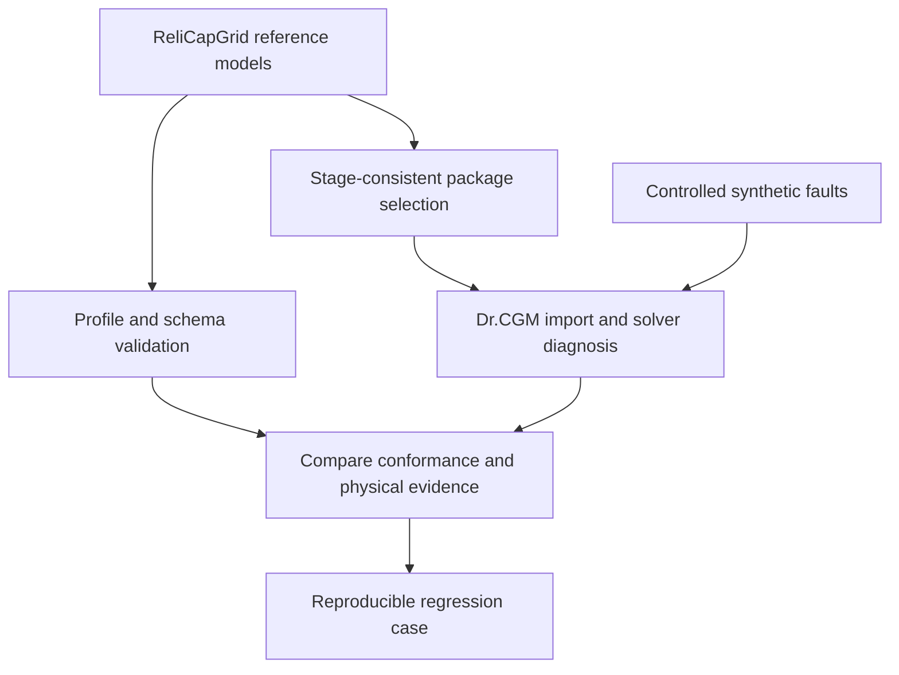

# Dr.CGM and ReliCapGrid

They address different parts of the same engineering workflow. ReliCapGrid is an ENTSO-E reference-model repository with synthetic CGMES/Network Code data and associated tools. Dr.CGM is a diagnostic runner intended for supplied IGM/CGM snapshots, using PowSyBl to relate source conditions to import and electrical behavior.

## Comparison

| Dimension | ReliCapGrid | Dr.CGM v0.2 |
|---|---|---|
| Main deliverable | Synthetic multi-TSO grid and operational-process datasets | Executable diagnostic CLI and evidence reports |
| Profiles/processes | CGMES and Network Code profiles for CSA, CCC, OPC and STA use cases | Curated CGMES source checks, importer behavior, topology and AC/DC diagnosis |
| Validation | Header/reference/UUID tests plus SHACL/schema validation workflow using application-profile artifacts | Selected source and physical checks, native state validation and actual OpenLoadFlow replay |
| Tools beyond data | Packaging, format/semantic utilities and CI validation | Manifest preparation, isolated workers, experiment matrix, subset replay and source/configuration diff |
| Causal investigation | Useful reproducible reference inputs and expected modeling context | Sensitivity evidence and investigation candidates, with source IDs and actions |
| Output | Model artifacts and repository validation outputs | Local HTML, JSON, CSV, SQLite and complete native PowSyBl reports |
| Production alignment/GLSK reproduction | Test-model/process context, not the RCC's proprietary runtime | Not implemented; records supplied stage measurements and exposed engine settings |
| Best joint use | Provide reproducible models and conformance evidence | Diagnose import/solver behavior, add controlled fault regressions, investigate differences |

There is overlap in basic data checks. Describing ReliCapGrid as "only test files" would miss its validation and packaging tooling. Dr.CGM does not replace those validators; its strongest addition is structured electrical replay, controlled sensitivity experiments and evidence tracing.



## Reference version inspected

Inspected on 23 September 2026 using the repository's then-default branch `cgmes-3.0_ncp-2.5_tc-2.0`, pinned at commit `f09bb340795122b43d6499e913c121bb21458859`. Repository defaults and web indexes can differ over time; use the commit for reproducible work.

Primary sources at that commit:

- [Repository README](https://github.com/entsoe/relicapgrid/blob/f09bb340795122b43d6499e913c121bb21458859/.github/README.md)
- [CGM packaging utility](https://github.com/entsoe/relicapgrid/blob/f09bb340795122b43d6499e913c121bb21458859/buildScripts/create_cgm_zip.py)
- [Data-validation tests](https://github.com/entsoe/relicapgrid/blob/f09bb340795122b43d6499e913c121bb21458859/tests/test_validation.py)
- [Header tests](https://github.com/entsoe/relicapgrid/blob/f09bb340795122b43d6499e913c121bb21458859/tests/test_dataset_header.py)
- [SHACL/schema workflow](https://github.com/entsoe/relicapgrid/blob/f09bb340795122b43d6499e913c121bb21458859/.github/workflows/shacl_validation.yml)
- [Power-flow settings](https://github.com/entsoe/relicapgrid/blob/f09bb340795122b43d6499e913c121bb21458859/docs/PowerFlowCalculationSettings.adoc)

## Correctly assemble this reference CGM

The current package layout distinguishes original TSO states from RCC-updated states. The helper uses:

| Input | Selection |
|---|---|
| Equipment | EQ from every TSO/HVDC `Instance/<region>/Grid/cimxml` folder |
| RCC topology and solved state | TP and SV from `Instance/Jotunheim/Grid/cimxml` |
| RCC-updated per-IGM hypotheses | SSH revision files from `Instance/Jotunheim/ChangeSet/cimxml` |
| Boundaries | All XML from `Instance/boundaryData/Grid/cimxml` |
| Common grid data | `Instance/commonData/Grid/cimxml/Grid_CommonData_CGM-CD.xml` |

Original TSO SSH/TP/SV must not also be included in this assembled CGM. The ChangeSet directory here contains complete updated SSH profiles; arbitrary DifferenceModels elsewhere still require materialization. The helper checks required files and understands the DC-folder versus HVDC-delivery naming difference.

```powershell
git clone --branch cgmes-3.0_ncp-2.5_tc-2.0 https://github.com/entsoe/relicapgrid.git ..\relicapgrid
git -C ..\relicapgrid checkout f09bb340795122b43d6499e913c121bb21458859
.\.venv\Scripts\python.exe prepare_relicapgrid.py --repo ..\relicapgrid --mode cgm --out cases\relicap-cgm.json
.\.venv\Scripts\python.exe diagnose.py --manifest cases\relicap-cgm.json --out runs\relicap-cgm
```

For original IGM replay:

```powershell
.\.venv\Scripts\python.exe prepare_relicapgrid.py --repo ..\relicapgrid --mode igm --tsos Belgovia --out cases\relicap-belgovia.json
```

The helper copies no data. It writes absolute paths and a sibling `.provenance.json` with the Git commit and packaging reference. All boundaries/common data are retained for dependency closure. Partial TSO selection is rejected in CGM mode because the RCC TP/SV describe the full package. NCP process files are not passed to the electrical importer.

## Observed integration result

A real local run used Python 3.12.14, PyPowSyBl 1.16.1 and the 27-profile package at the pinned commit. Two explicitly configured import cases were compared:

| Setting | Observed outcome |
|---|---|
| Importer default `iidm.import.cgmes.cgm-with-subnetworks=true` | Native conversion reported missing Substation attributes on voltage levels and failed with `VoltageLevel not found for voltageLevelId: 04664b78-c766-11e1-8775-005056c00008`; electrical replay incomplete |
| Explicit `iidm.import.cgmes.cgm-with-subnetworks=false` | Import completed: 275 buses, 113 generators, 192 loads, 311 lines, 85 two-winding and 1 three-winding transformer; baseline returned nine component results |

For the explicit alternative, baseline results were **three CONVERGED, one NO_CALCULATION** (no voltage-controlled generator), and **five FAILED** with native status "Unrealistic state". The run completed with error findings; it did not produce a fully converged CGM. Imported-state consistency validation separately reported `non linear shunt not supported yet`, which remains an explicit coverage limitation.

Source checks also found a state-time mismatch: Portheim's updated SSH header uses `2024-12-23T06:42:14Z`, while the other selected state profiles use `2022-06-16T23:30:00Z`. The checker uses header values rather than filenames. One mRID shared by distinct boundary RDF identities was reported as an investigation warning.

These observations apply to this exact package/settings combination. They are not a judgment that the whole reference collection is invalid, nor proof that one source condition explains all component failures. The helper now explicitly sets `cgm-with-subnetworks=false` for this assembled reference case; it never silently retries or rewrites source data. The two-case experiment shows import-setting sensitivity. It does not by itself prove the internal converter's failure mechanism.

The helper's solver preset maps uniform initialization, single slack, reactive limits, transformer/phase/shunt controls, 25 Newton iterations and 20 outer loops. It is a **partial mapping** of the reference settings, not certified solver parity. In particular, it does not reproduce every convergence tolerance, control priority or active-power-limit semantic. The recorded component outcomes above used this preset with sensitivity experiments disabled; the generated manifest enables optional experiments for subsequent investigation.

## Licensing and data handling

ReliCapGrid identifies its dataset license as CC-BY-SA-4.0. Consult its license and attribution conditions when redistributing or adapting models. No ReliCapGrid model data is vendored into Dr.CGM; users work from their own local clone. No production RCC data or shared-conversation transcript is included.
